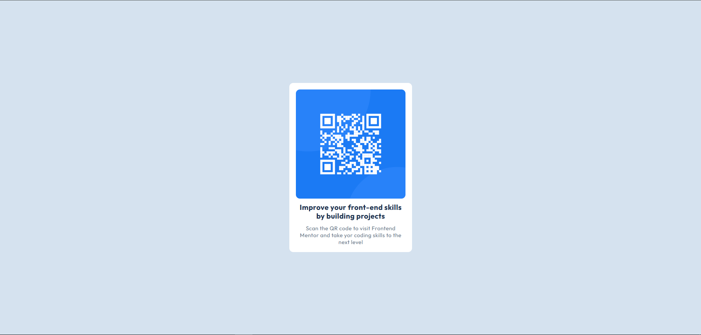

# Frontend Mentor - QR code component solution

This is a solution to the [QR code component challenge on Frontend Mentor](https://www.frontendmentor.io/challenges/qr-code-component-iux_sIO_H). Frontend Mentor challenges help you improve your coding skills by building realistic projects.

**Note: Delete this note and update the table of contents based on what sections you keep.**

## Overview

### Screenshot



### Links

- Solution URL: [Solution](https://www.frontendmentor.io/solutions/qr-code-component---html-css-VkVBEN9qMQ)
- Live Site URL: [Live site](https://fm-qr-code-mohamed-ahmed.netlify.app/)

### What do I like to do?

```css
.proud-of-this-css {
  gap: 12px; /* instead of using margin bottom on every element :d */
}
```
